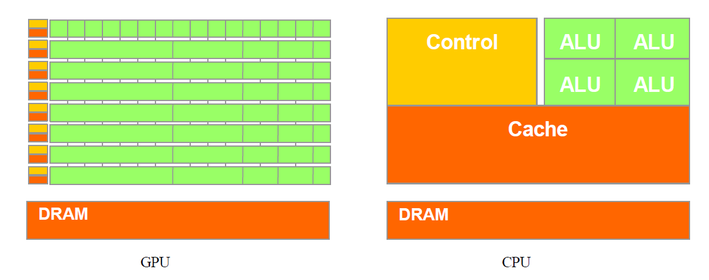

第一章 绪论
===========

1.1 Programmable Graphics Processing Unit 发展历程
--------------------------------------------------

Programmable Graphics Processing Unit（ GPU），即可编程图形处理单元，

通常也称之为可编程图形硬件。

GPU的发展历史
-------------

GPU 概念在 20 世纪 70 年代末和 80 年代初被提出，使用单片集成电路（
monolithic）作为图形芯片，此时的 GPU
已经被用于视频游戏和动画方面，它能够很快地进行几张图片的合成（仅限于此）。

-   在20 世纪 80 年代末到 90 年代 ，基于数字信号处理芯片（digital signal
    processor chip）的 GPU 被
    研发出来，与前代相比速度更快、功能更强，当然价格非常昂贵。

-   1991 年，S3 Graphics 公司研制出第一个单芯片 2D 加速器。

-   1995 年，主流的 PC 图形芯片厂商都在自己的芯片上增加了对 2D 加速器的支持。

-   1998 年 NVIDIA 公司宣布 modern GPU 的研发成功，标志着 GPU 研发的历
    史性突破成为现实。

GPU发展的两个时期
-----------------

通常将 20 世纪 70 年代末到 1998 年的这一段时间称之为pre-GPU 时期，而自 1998
年往后的 GPU 称之为 modern GPU。

-   在 pre-GPU 时期， 一些图形厂商，如 SGI、Evans & Sutherland，都研发了各自的
    GPU，这些 GPU
    在现在并没有被淘汰，依然在持续改进和被广泛的使用，当然价格也是非常的高 昂。

-   而modern GPU 使用晶体管（transistors）进行计算，在微芯片（microchip）中，
    GPU 所使用的晶体管已经远远超过 CPU。

Modern GPU时期的四个阶段
------------------------

回顾 Modern GPU 的发展历史，自 1998 年后可以分为 4 个阶段。

1.  NVIDIA 于 1998 年宣布 Modern GPU 研发成功，这标志着第一代 Modern GPU
    的诞生， 第一代 Modern GPU 包括 NVIDIA TNT2，ATI 的 Rage 和 3Dfx 的
    Voodoo3。这 些 GPU 可以独立于 CPU
    进行像素缓存区的更新，并可以光栅化三角面片以及进
    行纹理操作，但是缺乏三维顶点的空间坐标变换能力，这意味着“必须依赖于 GPU
    执行顶点坐标变换的计算”。这一时期的 GPU 功能非常有限，只能用于纹理组合
    的数学计算或者像素颜色值的计算。

2.  从 1999 到 2000 年，是第二代 modern GPU 的发展时期。这一时期的 GPU
    可以进行三维坐标转换和光照计算（3D Object Transformation and Lighting,
    T&L），并且 OpenGL 和 DirectX7 都提供了开发接口，支持应用程序使用基于
    硬件的坐标变换。这是一个非常重要的时期，在此之前只有高级工作站（workstation）的图形硬件才支持快速的顶点变换。同时，这一阶段的
    GPU 对 于纹理的操作也扩展到了立方体纹理（cube map）。NVIDIA 的 GeForce256，
    GeForce MAX，ATI 的 Radeon 7500 等都是在这一阶段研发的。

3.  2001 年是第三代 modern GPU 的发展时期，这一时期研发的 GPU 提供 vertex
    programmability（顶点编程能力），如 GeForce 3，GeForce 4Ti，ATI 的 8500 等。
    这些 GPU 允许应用程序指定一个序列的指令进行顶点操作控制（GPU 编程的本
    质！），这同样是一个具有开创意义的时期，这一时期确立的 GPU 编程思想一
    直延续到 2009 年的今天，不但深入到工程领域帮助改善人类日常生活（医疗、
    地质勘探、游戏、电影等），而且开创或延伸了计算机科学的诸多研究领域 （体
    绘制、光照模拟、人群动画、通用计算等）。同时，Direct8 和 OpenGL 都本着
    与时俱进的精神，提供了支持 vertex programmability 的扩展。不过，这一时期的
    GPU 还不支持像素级的编程能力，即 fragment programmability（片段编程能力），
    在第四代 modern GPU 时期，我们将迎来同时支持 vertex programmability 和
    fragment programmability 的 GPU。

4.  第四代 modern GPU 的发展时期从 2002 年末到 2003 年。NVIDIA 的 GeForce FX 和
    ATI Radeon 9700 同时在市场的舞台上闪亮登场，这两种 GPU 都支持 verte x
    programmability 和 fragment programmability。同时 DirectX 和
    OpenGL也扩展了自身的 API，用以支持 vertex programmability 和 fragment
    programmability。自 2003 年起，可编程图形硬件正式诞生，并且由于 DirectX 和
    OpenGL 锲而不舍的追赶潮流，致使 基于图形硬件的编程技术简称 GPU
    编程，也宣告诞生。

图1
